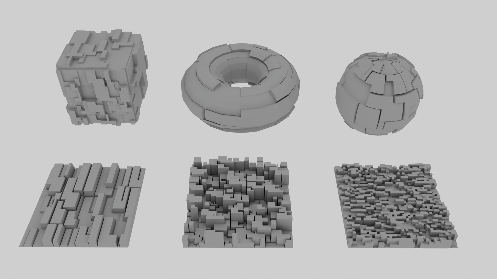
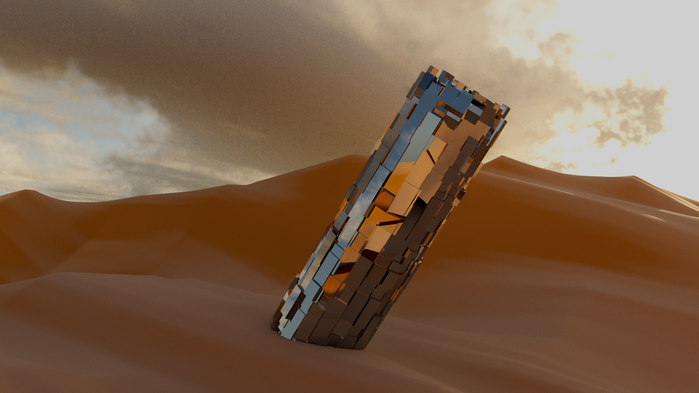

# randomExtrude
A (work in progress) Maya plugin command for creating random extrusions using the maya python API 2.0. Can be used to make a model look larger and more complex (see [greebles](https://en.wikipedia.org/wiki/Greeble)). 

#### Some examples: 

#### <code>randomExtrude</code> arguments:
- **Thickness range**, -tr -thicknessRange (*float*, *float*)  
The min/max thickness that a group of faces will be extruded 
- **Offset**, -o -offset (*bool*)  
Whether to offset the extrusion 
- **Max faces**, -mf -maxFaces (*Long*)  
The max number of faces to extrude together 

#### Installation: 

1. Copy random_extrude.py to Maya's default plug-in path. By default, this is <user's directory>/Documents/maya/verion/plug-ins.

2. Open Maya and load ".py" through the Plug-in Manager (Windows > Settings/Preferences > Plug-in Manager)

3. Select a poly object and call randomExtrude
